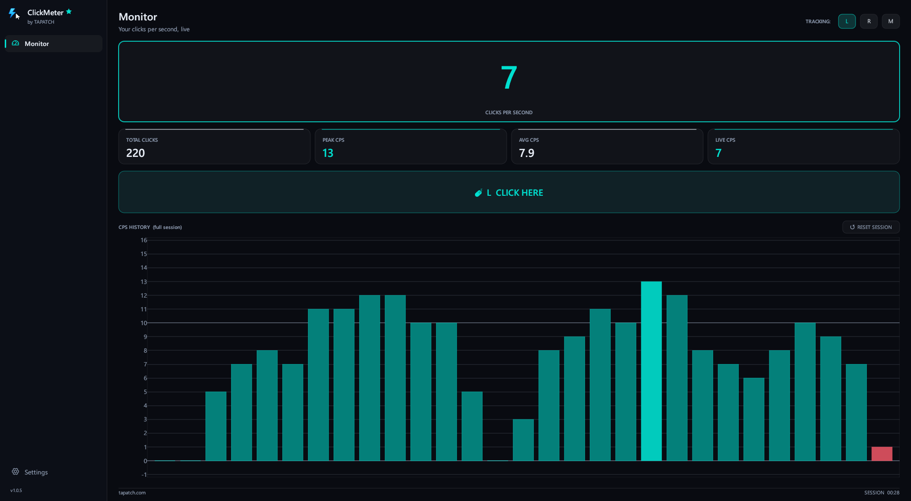
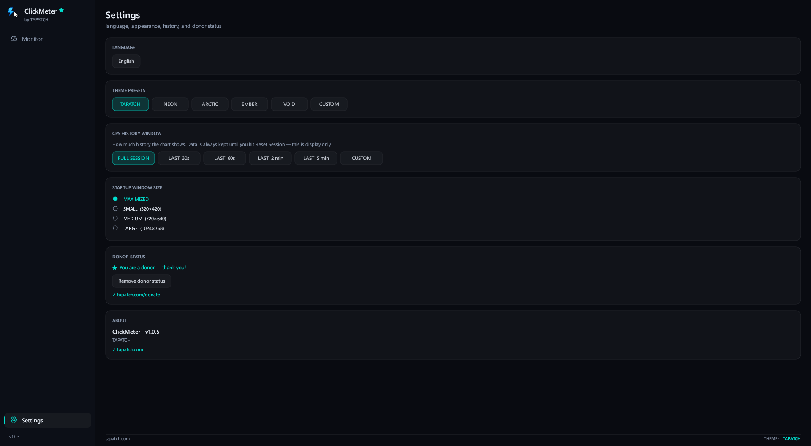

<p align="center"></p>
<h1 align="center">ClickMeter</h1>
<p align="center"><b>Beats browser click tests. Real CPS, zero lag.</b></p>
<p align="center">CPS Tracker · Windows 10/11 · x64 · ~4 MB · Free for personal use</p>
<p align="center"><a href="https://github.com/tapatchUSA/ClickMeter/releases/latest"><b>⬇ Download ClickMeter 1.0.5</b></a> &nbsp;·&nbsp; <a href="https://tapatch.com/tools/clickmeter/">tapatch.com/tools/clickmeter</a></p>

<p align="center">
<br>

</p>

> Web-based click counters run through a browser. ClickMeter doesn't. That gap shows in every measurement.

## What it does

ClickMeter tracks your click rate in real time with no overhead. It counts every click straight from a low-level mouse hook, so nothing slips past — even rapid or injected bursts that browser-based testers miss. Track left, right, or middle clicks, alone or combined. Live CPS updates instantly, peak and session average stay visible, and a configurable history chart shows anywhere from the last 30 seconds up to your full session. Tiny binary, zero telemetry, entirely local.

[](https://www.youtube.com/watch?v=Q6VxlR-KWro)

## Features

More packed in than it looks. Here are the highlights.

**⚡ Live CPS**  
Clicks per second updates in real time. No delay, no averaging lag — the number you see is the number you're hitting.

**🎣 Counts every click**  
A low-level mouse hook catches each individual click — physical, automated, or injected. Even rapid batched bursts that browser testers miss are counted accurately.

**🖱️ L / R / M tracking**  
Count left, right, and middle clicks independently or together. Per-button breakdown shows current CPS and lifetime totals.

**📈 Peak + session average**  
Tracks your highest CPS burst and rolling session average across every tracked button.

**📉 Configurable history**  
Bar chart window: full session, last 30s, 60s, 2 min, 5 min, or a custom duration you dial in yourself.

**🪶 Zero measuring overhead**  
The hook runs on its own dedicated thread and never steals keyboard focus, so it doesn't slow down — or interfere with — whatever you're testing.

**🎨 Theme presets + custom**  
Tapatch, Neon, Arctic, Ember, Void, and a full custom theme editor with live preview.

## What's new in 1.0.5

- Cleaner new look: icon sidebar, big live CPS readout, stat cards and a calmer chart
- The click areas line up exactly with the buttons (they were about 30 pixels too high)
- No more missed clicks when clicking very fast
- The chart stays smooth in long sessions
- Seconds are counted exactly, including after the window was minimized
- Settings save right away, the Small window size fits, and narrow windows get a compact layout

Release notes for every version are on the [Releases](https://github.com/tapatchUSA/ClickMeter/releases) page.

## Install

1. Download **ClickMeter-Setup-1.0.5.exe** from the [latest release](https://github.com/tapatchUSA/ClickMeter/releases/latest) or from [tapatch.com](https://tapatch.com/tools/clickmeter/).
2. Run it. The installer and the app come in 10 languages.
3. Accept the Terms of Service on first launch.

Windows may show a SmartScreen warning for new downloads. Click **More info → Run anyway**.

Or with [Scoop](https://scoop.sh):

```powershell
scoop bucket add tapatch https://github.com/tapatchUSA/packages
scoop install tapatch/clickmeter
```

## All versions

| Version | Released | Installer | VirusTotal | SHA-256 |
|---|---|---|---|---|
| [1.0.5](https://github.com/tapatchUSA/ClickMeter/releases/tag/v1.0.5) | 2026-10-02 | [ClickMeter-Setup-1.0.5.exe](https://github.com/tapatchUSA/ClickMeter/releases/download/v1.0.5/ClickMeter-Setup-1.0.5.exe) | [4 / 71](https://www.virustotal.com/gui/file/ab252a3db9a766dbf55840482513abc7fc9275fed87b1d0e50d506e08f24e547/detection) | `ab252a3db9a766db…` |
| [1.0.4](https://github.com/tapatchUSA/ClickMeter/releases/tag/v1.0.4) | 2026-10-01 | [ClickMeter-Setup-1.0.4.exe](https://github.com/tapatchUSA/ClickMeter/releases/download/v1.0.4/ClickMeter-Setup-1.0.4.exe) | [3 / 71](https://www.virustotal.com/gui/file/f4342e4743b0e48f288ed9a63eea240ed80c21e6f53a0599fe5ff55038e9e729/detection) | `f4342e4743b0e48f…` |
| [1.0.3](https://github.com/tapatchUSA/ClickMeter/releases/tag/v1.0.3) | 2026-09-30 | [ClickMeter-Setup-1.0.3.exe](https://github.com/tapatchUSA/ClickMeter/releases/download/v1.0.3/ClickMeter-Setup-1.0.3.exe) | [3 / 71](https://www.virustotal.com/gui/file/a416879808ed9168f0988689bef2bad6627156f90c6cd64c1bb8b06b006cb6f5/detection) | `a416879808ed9168…` |
| [1.0.2](https://github.com/tapatchUSA/ClickMeter/releases/tag/v1.0.2) | 2026-05-29 | [ClickMeter-Setup-1.0.2.exe](https://github.com/tapatchUSA/ClickMeter/releases/download/v1.0.2/ClickMeter-Setup-1.0.2.exe) | [2 / 68](https://www.virustotal.com/gui/file/5791b1b947dded71e1776ee43a889db1d4e2dd005f995e04aff3d0d3f855ec73/detection) | `5791b1b947dded71…` |
| [1.0.1](https://github.com/tapatchUSA/ClickMeter/releases/tag/v1.0.1) | 2026-05-26 | [ClickMeter-Setup-1.0.1.exe](https://github.com/tapatchUSA/ClickMeter/releases/download/v1.0.1/ClickMeter-Setup-1.0.1.exe) | [2 / 71](https://www.virustotal.com/gui/file/9c1dbe8fc69700a9b188a326d3edaa006f453e236cc62deaaaa9dd6f94cb5fd0/detection) | `9c1dbe8fc69700a9…` |
| [1.0.0](https://github.com/tapatchUSA/ClickMeter/releases/tag/v1.0.0) | 2026-04-11 | [ClickMeter-Setup-1.0.0.exe](https://github.com/tapatchUSA/ClickMeter/releases/download/v1.0.0/ClickMeter-Setup-1.0.0.exe) | [2 / 72](https://www.virustotal.com/gui/file/5335e9348a6b9dcff20a6b1148f0bc5eb4e3bdaf90abe73f787897ee9bd3fe1b/detection) | `5335e9348a6b9dcf…` |

## Security

Every installer is scanned on VirusTotal before release. ClickMeter 1.0.5: **4 / 71** engines flag it · [view report](https://www.virustotal.com/gui/file/ab252a3db9a766dbf55840482513abc7fc9275fed87b1d0e50d506e08f24e547/detection)

**SHA-256**
```
ab252a3db9a766dbf55840482513abc7fc9275fed87b1d0e50d506e08f24e547
```

## Built with

Rust · egui · eframe

## License

Free for personal use. Business or commercial use requires a paid license (see [tapatch.com/terms](https://tapatch.com/terms/)). Full terms: [tapatch.com/terms/software](https://tapatch.com/terms/software/).

This repository holds the official installers and release notes.

---

**[tapatch.com](https://tapatch.com)**: small tools, serious quality. Built solo, shipped with care.
