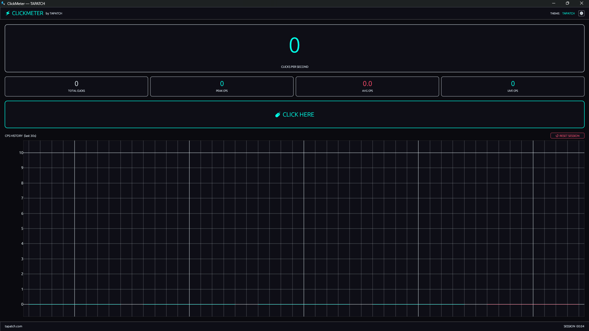

# 🖱️ ClickMeter

**Beats browser click tests. Real CPS, zero lag.**

> Web-based click counters run through a browser. ClickMeter doesn't. That gap shows in every measurement.



---

## Download

**[⬇ Download ClickMeter v1.0.0](https://tapatch.com/tools/clickmeter)** — Free for personal use · Windows 10/11 · x64

| | |
|---|---|
| Version | 1.0.0 |
| Platform | Windows 10/11 |
| Architecture | x64 |
| Size | ~3 MB |
| Price | Free |
| License | Personal use |

---

## What it does

ClickMeter tracks your click rate in real time with no overhead. See your live CPS the moment you click, watch your peak and session average update instantly, and visualise your pace on a live 30-second bar chart. Tiny binary, always-on-top mode, zero telemetry.

---

## Features

**⚡ Live CPS**
Clicks per second updates in real time. No delay, no averaging lag — the number you see is the number you're hitting.

**📈 Peak tracking**
Tracks your highest CPS burst across the session. Reset any time without closing the app.

**📊 Session average**
Calculates your average CPS across the full session, automatically weighted as you click.

**📉 30-second bar chart**
Rolling bar chart shows the last 30 seconds of click activity at a glance. See your pace and spot any slowdowns.

**📌 Always-on-top**
Optional always-on-top mode keeps ClickMeter visible while you game, test, or work in other windows.

**🪶 Zero overhead**
~3 MB binary. Launches instantly, uses negligible CPU and RAM. Never gets in the way.

---

## Changelog

### v1.0.0 — Initial release
- Live CPS counter with real-time updates
- Peak and session average tracking
- Rolling 30-second bar chart
- Always-on-top window mode
- One-click reset without closing

---

## Security

VirusTotal scan: **3 / 72 engines** — [View report](https://www.virustotal.com/gui/file/5335e9348a6b9dcff20a6b1148f0bc5eb4e3bdaf90abe73f787897ee9bd3fe1b/detection)

The 3 flags are ML heuristics from SecureAge, Microsoft, and Trapmine on an unsigned Rust binary. No major AV vendors flagged it.

**SHA-256**
```
5335e9348a6b9dcff20a6b1148f0bc5eb4e3bdaf90abe73f787897ee9bd3fe1b
```

---

## Built with

Rust · egui · eframe

---

## License

Free for personal use. See [Terms](https://tapatch.com/terms/software) for full license.

---

**[tapatch.com](https://tapatch.com)** — Small tools, serious quality. Built solo, shipped with care.
